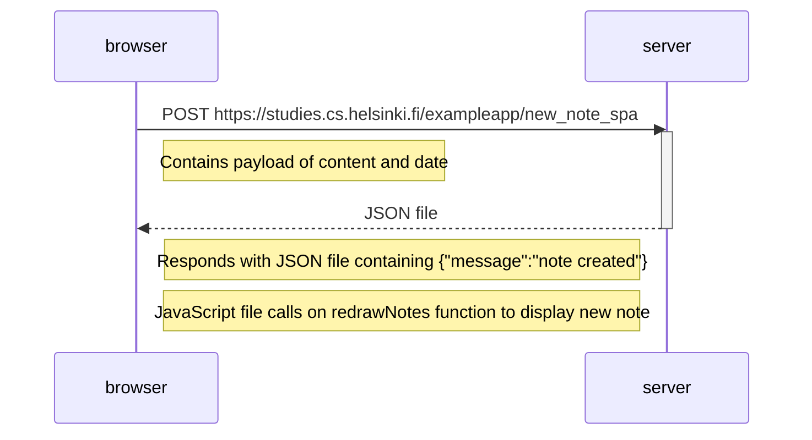

```mermaid
sequenceDiagram
    participant browser
    participant server

    browser->>server: POST https://studies.cs.helsinki.fi/exampleapp/new_note_spa
    activate server
    Note right of browser: Contains payload of content and date 
    
    server-->>browser: JSON file
    deactivate server
    Note left of server: Responds with JSON file containing {"message":"note created"}
    Note right of browser: JavaScript file calls on redrawNotes function to display new note
```